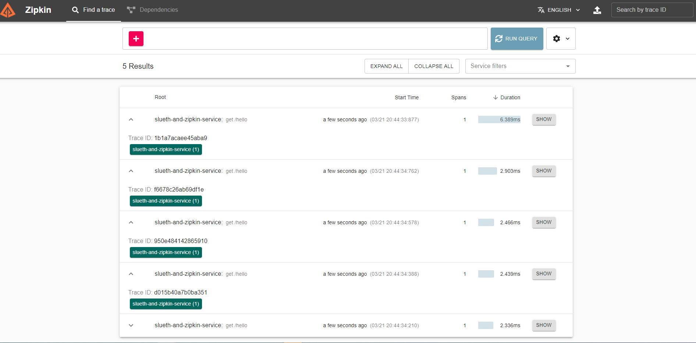

"# zipkin-demo" 

## Application exception when service is not connected to zipkin server
## Docker command for running zipkin server is :  docker run -d -p 9411:9411 openzipkin/zipkin
## UI is localhost:9411/zipkin

2021-03-21 20:36:56.319  WARN [slueth-and-zipkin-service,,] 5212 --- [/api/v2/spans}}] z.r.AsyncReporter$BoundedAsyncReporter   : Dropped 1 spans due to ResourceAccessException(I/O error on POST request for "http://localhost:9411/api/v2/spans": Connection refused: no further information; nested exception is java.net.ConnectException: Connection refused: no further information)

org.springframework.web.client.ResourceAccessException: I/O error on POST request for "http://localhost:9411/api/v2/spans": Connection refused: no further information; nested exception is java.net.ConnectException: Connection refused: no further information
at org.springframework.web.client.RestTemplate.doExecute(RestTemplate.java:785) ~[spring-web-5.3.5.jar:5.3.5]
at org.springframework.cloud.sleuth.zipkin2.ZipkinRestTemplateWrapper.doExecute(ZipkinRestTemplateWrapper.java:69) ~[spring-cloud-sleuth-zipkin-3.0.2.jar:3.0.2]